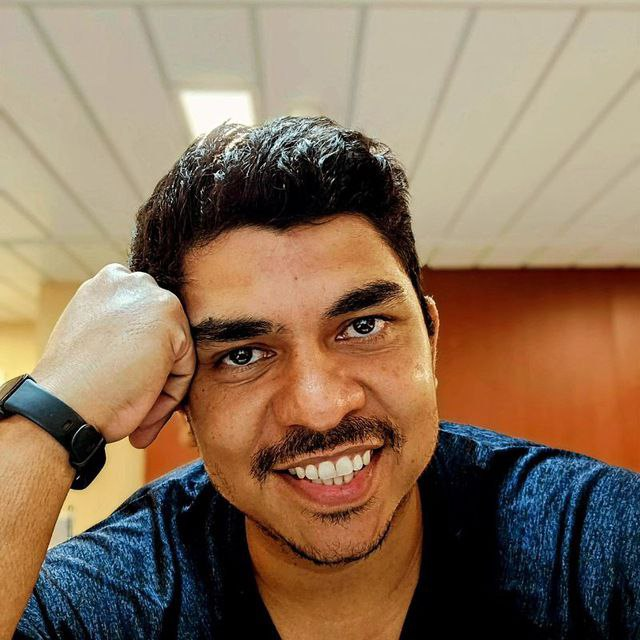

# AllDevs

Site autoral da AllDevs, criado para contar a historia de como começamos e vender freelas de desenvolvimento com uma experiencia visual forte, direta e artesanal.

A proposta desta versao e voltar ao essencial: HTML, CSS e JavaScript puros, com GSAP conduzindo movimento, narrativa e microinteracoes. Nada de framework por obrigação. A pagina precisa carregar rapido, comunicar valor em poucos segundos e ainda ter personalidade.

## Objetivo

Transformar a AllDevs em uma vitrine comercial e narrativa para:

- apresentar a historia do AllDevs de forma memoravel;
- vender servicos de sites, landing pages, apps, bots, MVPs e automacoes;
- mostrar dominio tecnico sem parecer um curriculo;
- reforcar a identidade de construtor rapido, pratico e orientado a produto;
- conduzir o visitante para contato pelo WhatsApp.

## Stack

- HTML sem build step
- CSS customizado
- JavaScript vanilla
- GSAP
- ScrollTrigger
- SplitText

## Estrutura

```text
.
├── index.html
├── historia.html
├── css/
│   ├── styles.css
│   └── servico.css
├── js/
│   └── servico-gsap.js
├── servicos/
│   ├── aplicativo-mobile-react-native/
│   ├── automacoes-integracoes-api/
│   ├── bots-whatsapp-automacao/
│   ├── criacao-de-sites-institucionais/
│   ├── desenvolvimento-mvp-startups/
│   └── landing-page-conversao/
└── assets/
```

## Paginas principais

`index.html`  
Home comercial com hero animado, particulas em canvas, secoes de servicos, projetos, stack, historia resumida e contato.

`historia.html`  
Pagina narrativa com timeline, manifesto horizontal em GSAP, cursor customizado e CTA para transformar a historia em conversa comercial.

`servicos/*/index.html`  
Paginas especificas para cada oferta, pensadas para SEO e conversao.

## Identidade

A AllDevs agora tem uma cara mais madura: tecnologia, velocidade e produto. A narrativa saiu do "grupo de devs" e passou para uma marca pessoal/comercial com lastro real:

- comeco programando pelo celular;
- primeiros freelas ainda menor de idade;
- Caio Guerras como a grande mente importante no inicio;
- AllDevs como laboratorio de automacoes e IA;
- produto com Machine Learning que passou de 100 mil usuarios;
- uso cedo de LLMs em processos reais;
- mentoria para desenvolvedores;
- ForjaDev como escola 1-on-1.

## Rodando localmente

Como o projeto e estatico, basta abrir `index.html` no navegador.

Se preferir servir com um servidor local:

```bash
python3 -m http.server 8000
```

Depois acesse:

```text
http://localhost:8000
```

## Filosofia

Este projeto nao tenta parecer grande. Ele tenta parecer vivo.

O foco e comunicar rapidamente: se existe uma ideia, um processo travado ou um produto que precisa sair do papel, a AllDevs constrói com velocidade, clareza e tecnologia suficiente para resolver o problema certo.

## Agradecimentos
<center>


A [Caio Guerras](https://www.linkedin.com/in/ocaioguerras/), por ser esse grande homem que inspirou e guiou os primeiros passos da AllDevs. Sem ele, nada disso existiria. Ele é a razão de tudo isso ter começado, e a AllDevs é uma extensão do legado que ele construiu. Obrigado, Caio, por tudo que você fez e continua fazendo pela comunidade de desenvolvedores. Você é uma lenda viva, e a AllDevs tem muito orgulho de ter sido parte da sua história.
</center>